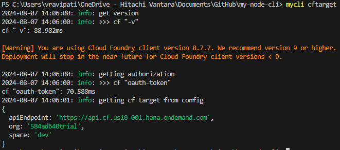

# my-node-cli

</br>

## Start project

</br>

npm init -y

</br>

## Compile to java script file

</br>

tsc .\sandbox\sandbox.ts

</br>

## Watching changes

</br>

tsc .\sandbox\sandbox.ts -w

</br>

When you are working with package.json in any form, you have 3 ways you can install your packages

- npm
- yarn
- pnpm

npm when it installs packages from npm repository, it saves into node_modules in your file system. So every project have node_modules installed. pnpm saves only once.

We are not going to bundle node with our cli. We are going to assume that the person running our script has node installed.

```
pnpm add -D typescript
```

tsconfig tells typescript how it should behave

https://github.com/tsconfig/bases/tree/main/bases

bin in package.json will add an executable on to the path in your global setup.

We have specifies our lib property. Which means DOM is not automatically included.

```
pnpm add -D @types/node
```

C:\Users\vravipati\AppData\Roaming\npm\mycli

npm install -g .

</br>
</br>

# Commands

</br>

<details>

<summary>hello</summary>

### hello

</br>


</br>


</br>

</details>

</br>

<details>

<summary>cftarget</summary>

### cftarget

</br>

Get cloud foundry target. Internally it uses cf cli

</br>


</br>



</br>

</details>

